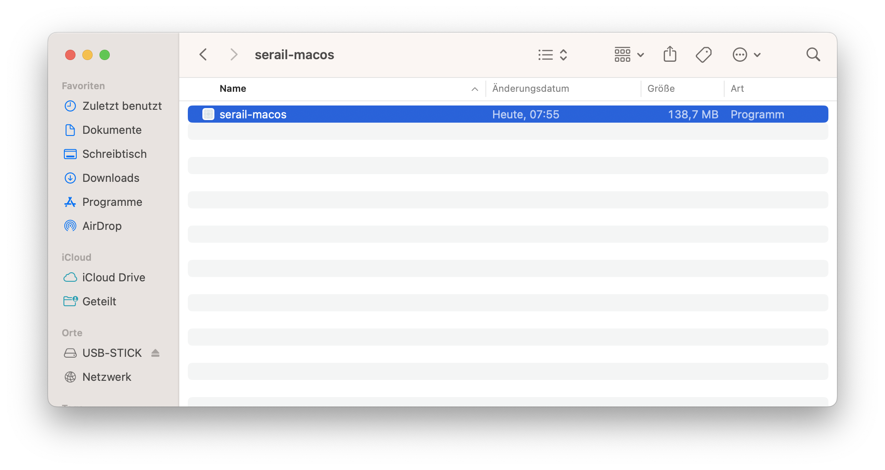
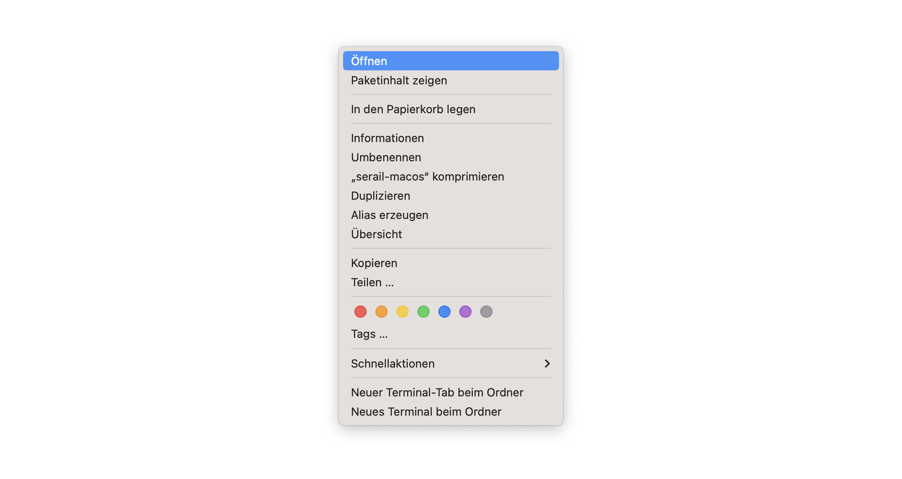
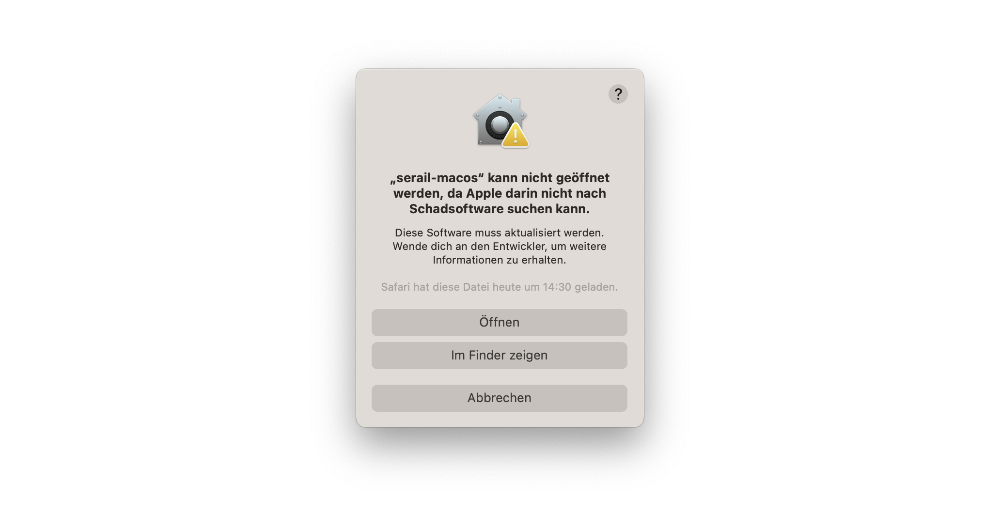

# Die Entführung aus dem Serail

## Installation Windows

1. Auf Releases oder den [Link](https://github.com/LS2021-dev/serail/releases/tag/v1.0.0-alpha) klicken
2. _serail-windows-x64.zip_ herunterladen
3. Ordner entpacken
4. _.exe_ Datei ausführen

## Installation MacOS

1. Auf Releases oder den [Link](https://github.com/LS2021-dev/serail/releases/tag/v1.0.0-alpha) klicken
2. _serail-windows-x64.zip_ herunterladen
3. Ordner entpacken
4. Wichtig:
    1. Ordner in neuem Fenster öffnen
       
    2. Rechtsklick auf das Programm und dann auf "Öffnen" klicken
       
    3. "Öffnen" klicken (**Wichtig**: Wenn die Option "Öffnen" nicht gegeben ist auf "Abbrechen" klicken und Schritt ii wiederholen)
       

## Steuerung

| Taste                   | Funktion                                  |
|-------------------------|-------------------------------------------|
| `Leertaste`             | springen/nächter Dialog                   |
| `W`/`Pfeiltaste oben`   | Leiter hochklettern                       |
| `A`/`Pfeiltaste links`  | links                                     |
| `S`/`Pfeiltaste unten`  | Leiter runterklettern                     |
| `D`/`Pfeiltaste rechts` | rechts                                    |
| `esc`                   | Pause Menu öffnen/Einstellungen schließen |

## Ablauf

- Dialoge müssen mit Leertaste durchgeschaltet werden
- Spieler kann sich mit `WASD` oder den `Pfeiltasten` und `Leertaste` bewegen, sobald ein Dialog/Song beendet wurde (
  erkennbar daran, dass am
  unteren
  Bildschirmrand keine Box zu sehen ist)
- Spieler muss nur den Anweisungen aus den Dialogen folgen (siehe [Aufgaben](#aufgaben))

## Aufgaben

1. Pedrillo folgen
2. Leiter hochklettern
